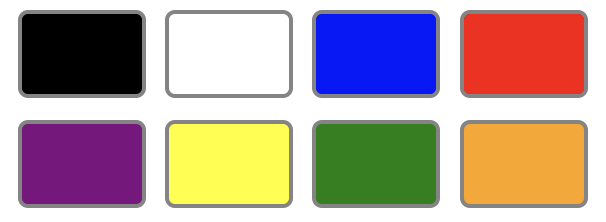
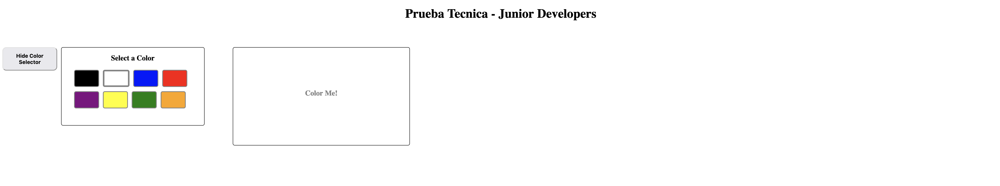

# PRUEBA TÉCNICA - PUESTO JUNIOR DEVELOPER

## Ejercicio 1

####  Tiempo Límite 90 minutos

Crea una función en PHP que reciba dos arrays y un booleano y retorne un array con las siguientes condiciones:

 * Si el booleano es verdadero buscará y retornará los elementos comunes de los dos array.
 
 * Si el booleano es falso buscará y retornará los elementos no comunes de los dos array.

Utiliza el archivo index.php para realizar dicho ejercicio.
 
*NOTA IMPORTANTE - Está permitido el uso de cualquier función, **EXCEPTO** funciones propias del lenguage que lo resuelvan directamente.*

*En caso de no recordar el nombre de alguna función, puede usar la [Documentación Oficial de PHP](https://www.php.net/manual/es/) como ayuda.*

### Array 1
 ```php
    $array1Data = [4, 5, 2, 3, 3, 1]
 ```

### Array 2
 ```php
    $array2Data = [3, 2, 3, 2, 3, 4, 6]
 ```

### Output
 ```php
    /* ELEMENTOS COMUNES */
    Array ( [0] => 2 [1] => 3 [2] => 4 ) 

    /* ELEMENTOS NO COMUNES */
    Array ( [0] => 1 [1] => 5 [2] => 6 ) 
 ```

## Ejercicio 2

####  Tiempo Límite 40 minutos

Crea una función usando jQuery y javascript que muestre un selector de color en una ventana y al hacer click en el color que corresponda, cambie el color de fondo de un div que por defecto viene coloreado en blanco.

Utilizar como plantilla para el ejercicio el archivo *jquery.html*.

Los colores dados son los siguientes:

 ```php
#000 - Negro
#fff - Blanco
#0718f5 - Azul
#ea3323 - Rojo
#75187c - Morado
#fffe54 - Amarillo
#377d22 - Verde
#f2a83b - Naranja
```
El color picker quedaría de la siguiente forma:



Y el resultado final del ejercicio podría ser algo así:



*NOTA - En caso de necesitar usar estilos CSS, **no está permitido usar estilos en linea**, puedes usar un archivo externo o crear una etiqueta style en el head del documento.*

*En caso de no recordar el nombre de alguna función, puede usar la [Documentación Oficial de jQuery](https://jquery.com/) o la [Documentación Oficial de javascript](https://developer.mozilla.org/es/docs/Web/JavaScript)*